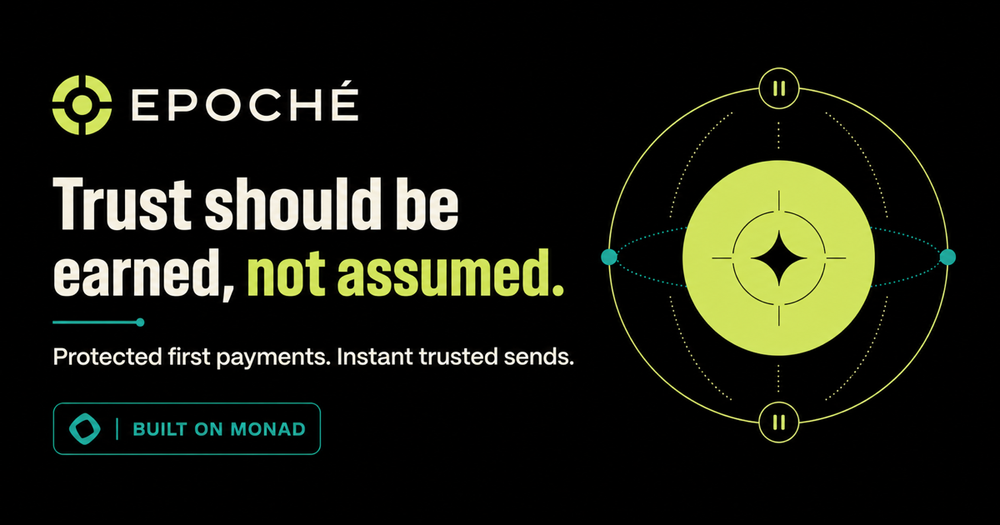
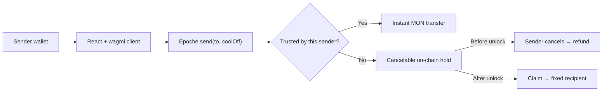

# Epoché

<p align="center">
  
</p>

<p align="center">
  <strong>Trust should be earned, not assumed.</strong>
</p>

<p align="center">
  A first-contact trust layer for native MON payments on Monad.
</p>

<p align="center">
  <a href="https://epoche-five.vercel.app/">Live app</a> ·
  <a href="https://epoche-five.vercel.app/app">Open command center</a> ·
  <a href="https://epoche-five.vercel.app/faq">FAQ</a> ·
  <a href="https://testnet.monadvision.com/address/0xca49Fd7c48194F06756fDD3c05CD8055CB652F65">Testnet contract</a>
</p>

## Why Epoché

Crypto transfers are unforgiving. A wrong address, a clipboard attack, or an unnoticed mistake can permanently move funds before the sender has time to react. Confirmation dialogs help only before signing; they cannot protect a transaction after it is submitted.

Epoché makes finality progressive:

- **Untrusted recipient:** MON enters a short, on-chain hold that the sender can cancel before it unlocks.
- **Trusted recipient:** MON is transferred immediately, without an unnecessary delay or cancel window.
- **Trust remains explicit:** every sender manages their own trusted recipients and can revoke trust at any time.

The result is protection for first contact and speed for established relationships.

> Epoché is not marketplace escrow. It is sender-side protection for mistakes and first-contact risk.

## Product flow

1. Connect a wallet on Monad Testnet.
2. Enter an untrusted recipient and choose a short protection window.
3. Review the complete address, amount, and unlock behavior before signing.
4. Cancel and recover the MON if something is wrong, or let the transfer unlock for the fixed recipient.
5. Mark a verified recipient as trusted so future payments are instant.

| Recipient state | Settlement | Sender can cancel? | Recipient outcome |
| --- | --- | --- | --- |
| Untrusted | On-chain hold | Yes, before unlock | Claimable only to the fixed recipient after unlock |
| Trusted | Immediate transfer | No | Receives MON instantly |

## How it works



Calling `claim(id)` is permissionless after unlock so anyone can help settle a transfer, but the contract always pays the recipient recorded when the transfer was created. A caller cannot redirect the funds.

## Deployed contract

| Item | Value |
| --- | --- |
| Network | Monad Testnet |
| Chain ID | `10143` |
| Contract | [`0xca49Fd7c48194F06756fDD3c05CD8055CB652F65`](https://testnet.monadvision.com/address/0xca49Fd7c48194F06756fDD3c05CD8055CB652F65) |
| Default hold | 15 minutes |
| Maximum hold | 30 minutes |
| Asset | Native MON |

The contract exposes four primary actions:

```solidity
send(address to, uint64 coolOff) payable
cancel(uint256 id)
claim(uint256 id)
setTrusted(address to, bool isTrusted)
```

## Contract guarantees

- Trust is scoped by `sender → recipient`; one user's decision never changes another user's trust list.
- Only the original sender can cancel, and only before the unlock timestamp.
- Claims cannot be redirected: settlement always pays the stored recipient.
- Transfer state is finalized before MON is sent, preventing a transfer from being canceled or claimed twice.
- Cool-off periods are bounded by an immutable maximum.
- The protocol charges no fee and has no owner-controlled custody path.

## Technology

| Layer | Stack |
| --- | --- |
| Smart contract | Solidity `0.8.24`, Foundry |
| Web app | React 19, TypeScript, Vite |
| Wallet and RPC | wagmi, viem, TanStack Query |
| Styling | Tailwind CSS |
| Network | Monad Testnet |

## Repository structure

```text
contracts/
├── src/Epoche.sol          Core trust and transfer contract
├── test/Epoche.t.sol       Unit, invariant-style, and fuzz tests
└── script/Deploy.s.sol     Monad deployment script

app/
├── src/                    Landing page, command center, FAQ, hooks
└── public/                 Social preview and brand assets
```

## Run locally

### Web app

```bash
cd app
cp .env.example .env
npm install
```

Set the deployed contract in `app/.env`:

```bash
VITE_EPOCHE_ADDRESS=0xca49Fd7c48194F06756fDD3c05CD8055CB652F65
VITE_RPC_URL=https://testnet-rpc.monad.xyz
```

Then start the app:

```bash
npm run dev
```

Production checks:

```bash
npm run lint
npm run build
```

### Smart contract

Install [Foundry](https://book.getfoundry.sh/getting-started/installation), then run:

```bash
cd contracts
forge test --offline
```

Current result: **25 passed, 0 failed**.

To deploy your own instance:

```bash
cd contracts
cp .env.example .env
# Add a dedicated testnet PRIVATE_KEY to .env

source .env
forge script script/Deploy.s.sol:DeployScript \
  --rpc-url "$MONAD_RPC" \
  --broadcast
```

Never commit a private key or use a primary wallet for deployment.

## Threat model and limitations

Epoché is designed for sender-side mistakes: incorrect addresses, malicious clipboard replacement, and uncertainty during first contact.

It does **not** protect a seller who delivers goods before the hold ends—a sender can legitimately cancel during that window. Trusted sends are intentionally immediate and irreversible. The current deployment supports native MON only, runs on Monad Testnet, and has not received a professional security audit.

## Hackathon

Built for the [BuildAnything Spark Hackathon](https://buildanything.so/hackathons/spark) on Monad.

## License

Epoché is open source under the [MIT License](LICENSE).
